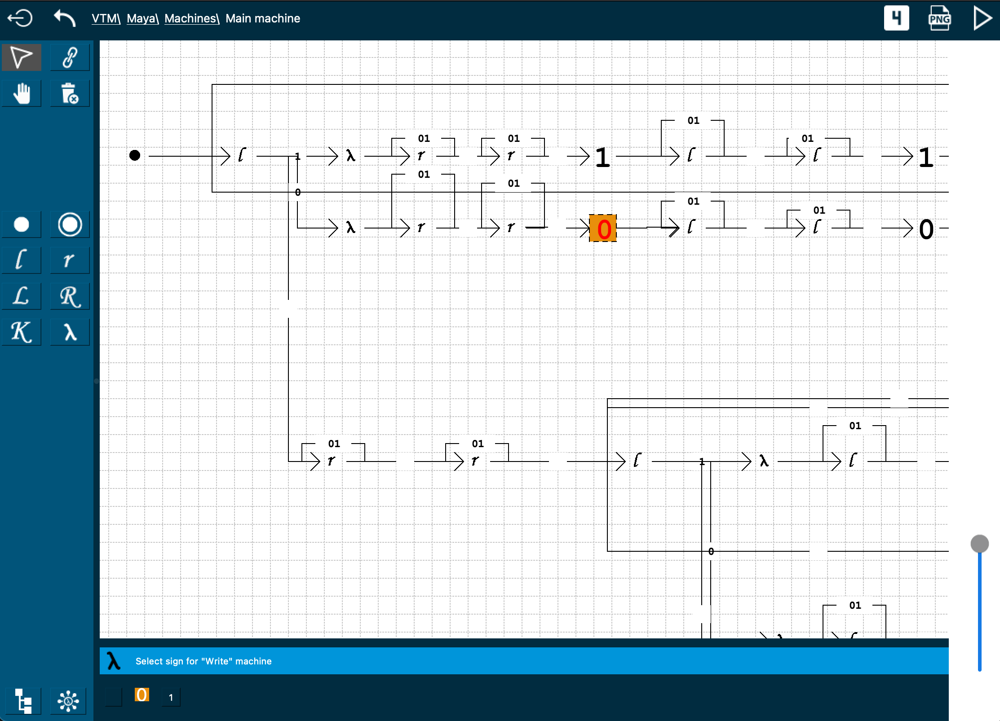

# VTM

## Описание

Эмулятор машин Тьюринга с поддержкой моделирования с помощью диаграмм.

Основные возможности:

* Поддержка диаграмм для создания программ для машин Тьюринга
* Поддержка "вложенных диаграмм"
* Поддержка рекурсивных вызовов машин
* Поддержка экспорта в программы в нотации "четверок"
* Поддержка экспорта диаграмм в формат PNG
* Поддержка работы на Windows/MacOS/Android/iOS/Linux

## Зависимости

* Используется компилятор с поддержкой C++ 17
* Используется QT 5.15