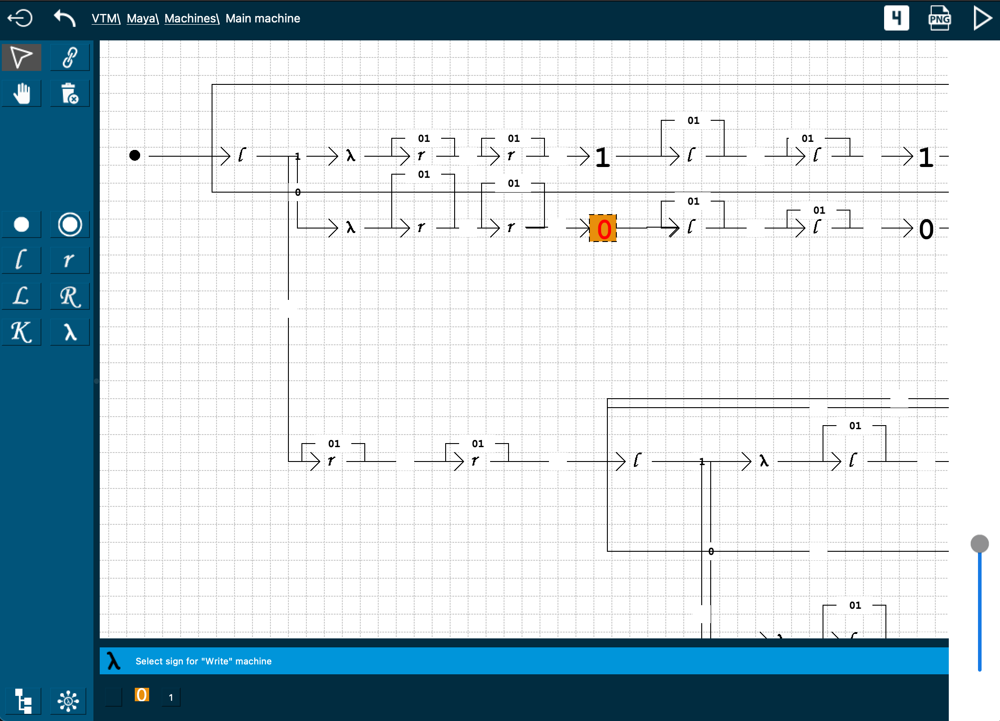

# VTM (Virtual Turing Machine)

Эмулятор машин Тьюринга с визуальным редактором диаграмм.

**Веб-версия (браузер):** [https://dvdemon.github.io/VTM/](https://dvdemon.github.io/VTM/) — редактор, проверка диаграммы, отладчик, обмен `.vmt.json` с десктопом; сборка из [`vmt-web/`](vmt-web/). Подробности — [`vmt-web/README.md`](vmt-web/README.md).

## Возможности

- Редактор диаграмм для программ машин Тьюринга
- Вложенные диаграммы и рекурсивные вызовы машин
- Сохранение и загрузка проектов (`.jdtp`)
- Экспорт в нотацию «четвёрок»
- Экспорт диаграмм в PNG
- Сборка под Windows, macOS, Linux, Android, iOS
- **Веб-клиент** ([`vmt-web/`](vmt-web/)) — React/Vite SPA на [GitHub Pages](https://dvdemon.github.io/VTM/): редактор, проверка, отладчик, светлая/тёмная тема, иконки узлов start/finish и панелей (как в десктопе)



## Зависимости

| Компонент | Версия |
|-----------|--------|
| C++ | 17 |
| Qt | 5.15+ (рекомендуется) или 6.5+ |
| CMake | 3.16+ (для сборки через CMake) |
| Компилятор | Clang / GCC / MSVC с поддержкой C++17 |

На **macOS (Apple Silicon)** kit Qt 5.15 `clang_64` собирает бинарник **x86_64** (через Rosetta). Нативная **arm64** сборка — через Qt 6.5+.

## Структура проекта

```
VTM/
├── CMakeLists.txt              # Корневой CMake-проект (VTM + тесты)
├── README.md
├── vmt-web/                    # Веб-клиент (Vite + React); https://dvdemon.github.io/VTM/
├── .github/workflows/          # CI: vmt-web (Pages), desktop-qt5152 (macOS + Windows)
├── documentation/              # Спецификация, ADR, Structurizr
├── docs/                       # Документация и скриншоты
├── tests/                      # Unit-тесты (Qt Test)
│   ├── CMakeLists.txt
│   ├── serialization/
│   │   └── test_machine_serialization.cpp
│   └── pathfinder/
│       └── test_pathfinder.cpp
└── VirtualTuringMachine/       # Исходный код приложения
    ├── VirtualTuringMachine.pro # Сборка через qmake / Qt Creator
    ├── CMakeLists.txt          # Библиотека vtm_core + исполняемый файл VTM
    ├── main.cpp                # Точка входа
    ├── mainwindow.*            # Главное окно
    ├── configuration.*         # Настройки и недавние проекты
    ├── form*.cpp/.h/.ui        # Экраны UI (редактор, отладчик, …)
    ├── uistate*.h              # Состояния интерфейса (state machine UI)
    ├── vmtproject.*            # Модель проекта
    ├── VMTSerializer.*         # Сериализация/десериализация проекта
    ├── resources.qrc           # Ресурсы (иконки, конфиги)
    ├── config/
    │   └── exercises.xml       # Упражнения (встроенный ресурс)
    ├── interfaces/             # Абстрактные интерфейсы ядра
    ├── vmtmachines/            # Типы машин Тьюринга
    ├── vmtactions/             # Действия на диаграмме (создание, связи, …)
    ├── vmtexport4th/           # Экспорт в «четвёрки»
    ├── android-sources/        # Манифест для Android-сборки
    └── Resources/              # Иконка приложения (macOS)
```

## Сборка

### Qt Creator (рекомендуется)

1. Откройте `VirtualTuringMachine/VirtualTuringMachine.pro`.
2. Выберите kit:
   - **Qt 6.5+ for macOS** — нативная arm64 на Apple Silicon;
   - **Qt 5.15.2 clang_64** — классическая сборка (x86_64 на Mac).
3. **Сборка → Собрать** (⌘B).

Каталоги сборки Qt Creator (`build-VirtualTuringMachine-*`) в git не попадают.

### qmake (командная строка)

**Qt 6 (macOS, arm64):**

```bash
export PATH="$HOME/Qt/6.5.2/macos/bin:$PATH"
cd VirtualTuringMachine
qmake VirtualTuringMachine.pro CONFIG+=release
make -j$(sysctl -n hw.ncpu)
```

**Qt 5.15 (macOS):**

```bash
export PATH="$HOME/Qt/5.15.2/clang_64/bin:$PATH"
cd VirtualTuringMachine
qmake VirtualTuringMachine.pro CONFIG+=release
make -j$(sysctl -n hw.ncpu)
```

Результат: `VirtualTuringMachine/VirtualTuringMachine.app`.

### CMake

```bash
# Qt 5.15 (путь подставьте свой)
export QTDIR="$HOME/Qt/5.15.2/clang_64"

cmake -B build -DCMAKE_BUILD_TYPE=Release
cmake --build build -j$(sysctl -n hw.ncpu)
```

Результат: `build/VirtualTuringMachine/VTM.app` (цель `VTM`, ядро — статическая библиотека `vtm_core`).

На Apple Silicon с Qt 5.15 CMake автоматически выставляет `CMAKE_OSX_ARCHITECTURES=x86_64`.

Опции CMake:

| Опция | По умолчанию | Описание |
|-------|--------------|----------|
| `BUILD_TESTS` | `ON` | Собирать unit-тесты в `tests/` |

Отключить тесты:

```bash
cmake -B build -DBUILD_TESTS=OFF
```

## Тесты

Тесты используют **Qt Test** и библиотеку `vtm_core`.

| Тест | Что проверяет |
|------|----------------|
| `test_machine_serialization` | Round-trip сериализации диаграммы (узлы, переходы, координаты) |
| `test_pathfinder` | Построение путей переходов: обход узлов, разделение путей на диаграммах с разным числом элементов |

```bash
cmake -B build -DCMAKE_BUILD_TYPE=Debug -DBUILD_TESTS=ON
cmake --build build --target test_machine_serialization test_pathfinder

# Запуск напрямую (headless на macOS)
QT_QPA_PLATFORM=offscreen ./build/tests/test_machine_serialization
QT_QPA_PLATFORM=offscreen ./build/tests/test_pathfinder

# Или через CTest
cd build && ctest -R "test_machine_serialization|test_pathfinder" --output-on-failure
```

`test_pathfinder` моделирует редактор: узлы — прямоугольные препятствия, уже построенные переходы — дополнительные «стены». Для цепочек из 3–7 узлов и сеток проверяется, что каждый новый путь не проходит через промежуточные узлы и не пересекается с ранее построенными (кроме общих точек подключения).

## Формат проекта (`.jdtp`)

Файл проекта — бинарный поток `QDataStream`:

1. Алфавит (строка UTF-8)
2. Число машин верхнего уровня
3. Для каждой машины — дерево узлов и переходов

**Узлы (формат v2, текущий):** маркер `-1`, затем `center`, `size`, `power`. Координаты сохраняются в каноническом виде, без пересчёта через `Update()` при загрузке.

**Узлы (формат v1, legacy):** `bounds` + `size` + `power`. Старые проекты по-прежнему открываются; границы восстанавливаются из файла без сдвига.

**Переходы:** геометрия и условия читаются до привязки к узлам; связи восстанавливаются без вызова pathfinder на этапе десериализации.

## Сборка и релизы на GitHub (macOS / Windows)

Workflow [`.github/workflows/desktop-qt5152.yml`](.github/workflows/desktop-qt5152.yml):

| Событие | Результат |
|---------|-----------|
| Push / PR в `main` (изменения в `VirtualTuringMachine/`) | Параллельная сборка **macOS** и **Windows** (Qt **5.15.2**), zip в артефактах Actions |
| Push тега `v*` (например `v1.0.0`) | [GitHub Release](https://github.com/DVDemon/VTM/releases) с zip в блоке **Assets** (macOS + Windows) |

Локально опубликовать релиз со ссылками на сборки:

```bash
git tag v1.0.0
git push origin v1.0.0
```

После успешного workflow откройте **Releases** → выберите тег → внизу **Assets** будут `VTM-…-macOS-….zip` и `VTM-…-Windows-….zip` (прямые ссылки на скачивание).

**Если в релизе только «Source code» / пустые Assets:** тег, скорее всего, создан **вручную** на старом коммите **до** появления workflow сборки. Тег `v1.0.0` сейчас указывает на `23a31d1`, а CI для desktop — на более новых коммитах. Варианты:

1. **Новый тег на актуальном `main`** (рекомендуется):
   ```bash
   git pull
   git tag v1.0.1
   git push origin v1.0.1
   ```
2. **Дозалить сборки в существующий [v1.0.0](https://github.com/DVDemon/VTM/releases/tag/v1.0.0):** Actions → **Desktop (Qt 5.15.2)** → **Run workflow** → включить **publish_release**, указать **release_tag** `v1.0.0` (соберёт текущий `main` и загрузит zip в этот релиз).
3. **Пересоздать тег** (если релиз можно удалить): удалить тег/релиз на GitHub, затем `git tag v1.0.0` на HEAD и `git push origin v1.0.0`.

Артефакты:

| Платформа | Архив | Содержимое |
|-----------|--------|------------|
| macOS | `VTM-<version>-macOS-Qt5.15.2-x86_64.zip` | `VTM.app` (`macdeployqt`) |
| Windows | `VTM-<version>-Windows-Qt5.15.2-x64.zip` | `VTM.exe` + Qt DLL (`windeployqt`) |

macOS: kit **x86_64** (Rosetta на Apple Silicon); нативный arm64 — Qt 6.5+ (см. «Зависимости»). Windows: **MSVC 2019 64-bit**, runner `windows-latest`.

Скачать сборку без тега: **Actions** → **Desktop (Qt 5.15.2)** → артефакты `VTM-macos-qt5152-x86_64` / `VTM-windows-qt5152-x64`.

## Запуск

### macOS

После сборки через **qmake**:

```bash
open VirtualTuringMachine/VirtualTuringMachine.app
```

После сборки через **CMake**:

```bash
open build/VirtualTuringMachine/VTM.app
```

Или из Qt Creator: **Запуск** (⌘R).

### Linux / Windows

Запустите собранный исполняемый файл из каталога сборки (`.exe` / бинарник без `.app`).

## Переменные окружения

| Переменная | Назначение |
|------------|------------|
| `QTDIR` | Путь к установке Qt (для CMake и qmake) |
| `PATH` | Добавьте `$QTDIR/bin` для вызова `qmake` из терминала |
| `QT_QPA_PLATFORM` | `offscreen` — для запуска тестов без GUI (macOS/Linux) |

Пример для Qt 5.15 на macOS:

```bash
export QTDIR="$HOME/Qt/5.15.2/clang_64"
export PATH="$QTDIR/bin:$PATH"
```
